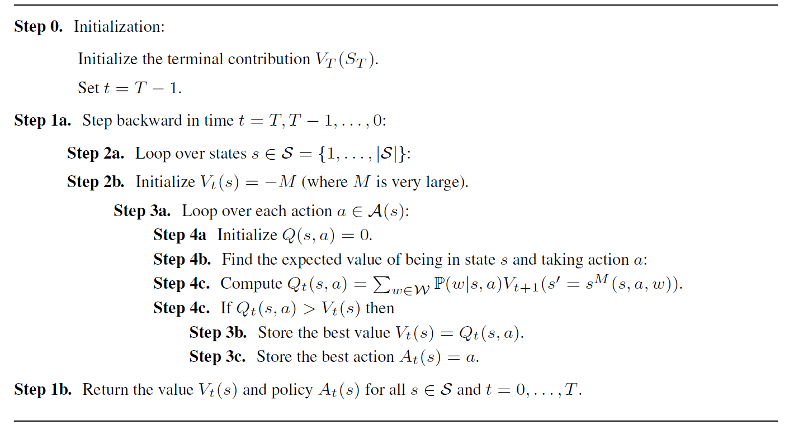
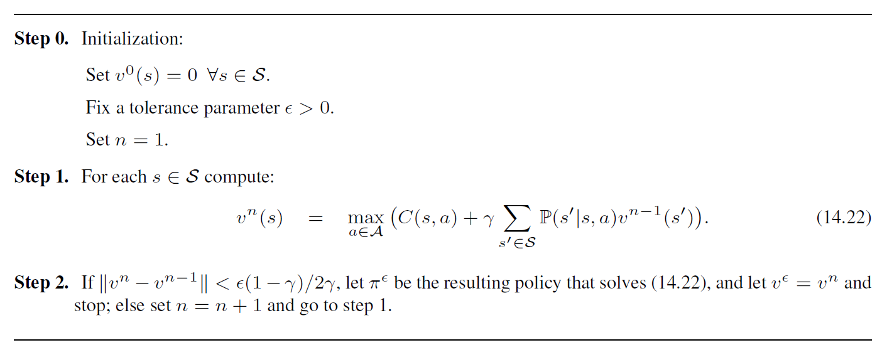

# Dynamic Programming for Inventory Systems

<!-- TOC depthFrom:2 -->

- [Introduction](#introduction)
- [Problem Description](#problem-description)
- [State Variable](#state-variable)
- [Action Variable](#action-variable)
- [Cost Function](#cost-function)
- [Bellman's Equation](#bellmans-equation)
- [Transition Probability](#transition-probability)
- [Transition Function](#transition-function)
- [Algorithms](#algorithms)
  - [Algorithm 1: Finite-horizon Problems](#algorithm-1-finite-horizon-problems)
  - [Algorithm 2: Infinite-horizon Problems](#algorithm-2-infinite-horizon-problems)
- [Getting Started (Usage)](#getting-started-usage)
  - [Execution Code](#execution-code)
  - [Member Functions](#member-functions)
- [Feedback](#feedback)
- [Author and Copyright](#author-and-copyright)


<!-- /TOC -->

## Introduction
This repository contains code that solves the inventory problem using dynamic programming (DP). The inventory problem is a practical example of a Markov Decision Process, where a decision maker has to make replenishment decisions for a product over a certain number of time periods.

## Problem Description

The inventory problem involves the decision maker making inventory decisions at the beginning of each period. The ordered quantities are assumed to be received instantly (zero lead time), and the demand for that period is realized afterward. The goal is to optimize ordering decisions to minimize costs.

### State Variable

At the beginning of each period, the decision maker observes the inventory level, which is represented as the state variable $S_t$, where $t$ is the period index.

### Action Variable

The ordering quantity for each period, to be used between periods $t$ and $t+1$, is represented as the action variable $𝑎_𝑡$.

### Cost Function

In this problem, we deal with a cost function rather than a reward function. The cost associated with each period $t$ in the planning horizon can be formulated as follows:

```math
C_t\left(S_t,a_t\right)=h\left(S_t+a_t-{\hat{D}}_{t+1}\right)^++p\left({\hat{D}}_{t+1}-S_t-a_t\right)^++ca_t 
```

where $S_t$ and $a_t$ are the state and action in period $t$, respectively. ${\hat{D}}_{t+1}$ is the realized demand of that period. $h$ is the holding cost per unit (for unsold units), $e$ is the unit backlog cost (for unsatisfied demand), and $c$ is the ordering cost per unit. Note that $(𝑥)^+=𝑚𝑎𝑥(0,𝑥)$.

### Bellman's Equation

Bellman's equation is a fundamental equation in DP. In this inventory problem, we modify the equation to accommodate the cost function:

```math
V_t\left(S_t\right)={min}_{a_t\in A_t}{C_t\left(S_t,a_t\right)+\gamma\sum_{s^\prime\epsilon S}{P\left(S_{t+1}= s^\prime|S_t=s,a_t=a\right)V_{t+1}\left(s^\prime\right)}}   \quad    \forall\ t=0,\cdots,T 
```

where $𝑉_𝑡(S_t)$ is the value function for period $𝑡$, $𝐴_𝑡$ is the set of possible actions in period 𝑡, $\gamma$ is the discount factor, and $P\left(S_{t+1}=\left.\ s^\prime\right|S_t,a_t\right)$ is the transition probability from state $S_t$ to $S_{t+1}$ given action $a_t$.

### Transition Probability

```math
P\left(S_{t+1}= s^\prime|S_t,a_t\right)=
\begin{cases}
0 & \text{if } s^\prime > S_t+a_t \\
P^D\left(S_t+a_t-s^\prime\right) & \text{if } 0 < s^\prime < S_t+a_t \\
\sum_{d = S_t+a_t}{P^D \left( d \right)} & \text{if } s^\prime=0 
\end{cases}
```

### Transition Function

The transition function describes the change in the inventory level from period $𝑡$ to period $𝑡+1$. In this problem, the transition function is as follows:
```math
S_{t+1}=\left(S_t+a_t-{\hat{D}}_{t+1}\right)^+  
```
where $(𝑥)^+$ represents the positive part of 𝑥, ensuring that the inventory level cannot be negative.


## Algorithms

The algorithms implemented in `function.py` are based on the following reference book:

- Author: Warren B. Powell
- Title: Reinforcement Learning and Stochastic Optimization: A Unified Framework for Sequential Decisions
- Publisher: John Wiley & Sons, Inc.
- Year: 2022
- ISBN: 9781119815037
- [Book URL](https://doi.org/10.1002/9781119815068)
- [DOI](https://doi.org/10.1002/9781119815068)


### Algorithm 1: Finite-horizon Problems

This algorithm solves finite-horizon problems by employing backward DP. It starts from the final period and calculates the cost function of DP. Then, it moves backward and computes the cost of the previous period. This procedure continues until the first period.

In other words, when we are at time $𝑡$ and state $S_t$, the value of $V_{t+1}(S_t)$ has already been computed. Therefore, by finding the total cost of $S_t$, we can calculate the $V_t(S_t)$. This algorithm is commonly known as backward DP.

Implementing the backward DP algorithm for finite-horizon problems is straightforward. The steps of the algorithm are as follows:

1. Initialize the value function for the final period as the cost function at that period.
2. Iterate backward from the second-to-last period to the first period:
   a. Compute the cost of the current period based on the cost function and the expected values of the next period.
   b. Update the value function for the current period based on the computed cost and the transition probabilities.
3. After iterating through all periods, the optimal decisions and associated costs can be obtained from the final value function.

The pseudocode for Algorithm 1 can be summarized as follows:




### Algorithm 2: Infinite-horizon Problems

The infinite-horizon problem differs slightly from the finite-horizon problem. In this case, since the last period is unknown, we cannot directly apply the algorithms used for finite-horizon problems. Instead, we utilize an iterative algorithm called value iteration to update the cost function of DP until a stopping criterion is met.

Value iteration operates by iteratively updating the cost function until the expected cost function converges within a specified error tolerance. The stopping criterion is typically defined using a gap measure, such as $\frac{\epsilon(1-\gamma)}{2\gamma}$, where $\epsilon$ represents the desired error tolerance and $\gamma$ is the discount factor.

The value iteration algorithm for the case of infinite-horizon problems is as follows:

1. Initialize the value function arbitrarily or based on prior knowledge.
2. Iterate until convergence or a maximum number of iterations is reached:
   a. For each state 𝑆𝑡, compute the expected cost based on the value function of the previous iteration and the transition probabilities.
   b. Update the value function for the current iteration based on the computed expected costs.
   c. Check the convergence criterion to determine if the algorithm should terminate.
3. After convergence, the optimal decisions and associated costs can be derived from the final value function.

The pseudocode for the value iteration algorithm can be summarized as follows:



You can find the detailed implementation of these algorithms in the `function.py` file.


## Getting Started (Usage)

To solve the inventory problem, follow these steps:

1. Make sure you have Python installed on your system.
2. Download the repository or clone it using the following command: https://github.com/ghazaleh-khalili/dynamic_programming
3. Open the `function.py` file to view and modify the functions related to the inventory problem.
4. Open the `main.py` file to view and execute the main code that solves the inventory problem using DP.

You can customize the functions in `function.py` to suit your specific problem instance. Adjust the type of the demand distribution, and any other relevant variables according to your requirements. Execute the `main.py` file to obtain the optimal inventory decisions and associated value functions.

### Execution Code

The `main.py` file contains the execution code for solving the inventory problem using DP. It utilizes the value iteration algorithm for the infinite-horizon problem and the backward DP algorithm for the finite-horizon problem. The problem assumes that demand follows a Poisson distribution.

#### Problem Parameters

The problem parameters are defined as follows:

- `S`: List of possible states.
- `D`: List of possible demand values.
- `h`: Holding cost per unit.
- `e`: Penalty cost per unit shortage.
- `c`: Cost per unit order.
- `lambda_`: Mean (and parameter lambda) of the Poisson distribution.
- `T`: Planning horizon (for the finite-horizon problem).

#### Execution Steps

The code in `main.py` performs the following steps:

1. Define the problem parameters, such as the list of possible states, possible demand values, costs, and the planning horizon (if applicable).
2. Create an instance of the `InventorySystemInfinite` class, passing the problem parameters.
3. Perform value iteration on the infinite-horizon problem using the `value_iteration()` method of the `InventorySystemInfinite` class. This calculates the optimal policy and value function
4. Create an instance of the `InventorySystemFinite` class, passing the problem parameters.
5. Perform backward DP on the finite-horizon problem using the `backward_DP()` method of the `InventorySystemFinite` class. This calculates the optimal policy and value function for the specified time horizon.
6. The results, including the optimal policy and value function, are stored in the variables `optimal_policy` and `V` for the infinite-horizon problem, `optimal_policy_t` and `V_t` for the finite-horizon problem.


## Member Functions

The `function.py` file contains the implementation of the Inventory Problem using DP. It includes three classes: `InventorySystemBase`, `InventorySystemInfinite`, and `InventorySystemFinite`.

### `InventorySystemBase` Class

The `InventorySystemBase` class serves as the base class for the inventory system and provides shared functions. Key methods include:

- `__init__(S, D, h, e, c, lambda_)`: Initializes the inventory system with the necessary parameters.
- `C(s, a)`: Calculates the cost of taking action `a` in state `s`.

### `InventorySystemInfinite` Class

The `InventorySystemInfinite` class extends the `InventorySystemBase` class and represents an inventory system for infinite-horizon problems. It utilizes the value iteration algorithm for solving the problem. Key methods include:

- `P(s_next, s, a)`: Computes the transition probability from state `s` to `s_next` given action `a`.
- `value_iteration()`: Performs the value iteration algorithm to determine the optimal policy and value functions.

### `InventorySystemFinite` Class

The `InventorySystemFinite` class extends the `InventorySystemBase` class and represents an inventory system for finite-horizon problems. It uses the backward DP algorithm to solve the problem. Key methods include:

- `backward_DP(T)`: Performs the backward DP algorithm to determine the optimal policy and value functions for a given time horizon `T`.

These classes provide a flexible framework for solving inventory problems based on different problem settings and horizons.

Please refer to the source code in `function.py` for detailed implementation for each class and member function.

## Feedback

Your feedback is highly appreciated. If you have any suggestions, bug reports, or feature requests, please feel free to [open a new issue](https://github.com/ghazaleh-khalili/dynamic_programming/issues) or contact me via [email](mailto:ghazalehkli@gmail.com).

Thank you for your contribution!

## Author and Copyright

This project is authored and maintained by Ghazaleh Khalili ([ghazalehkli@gmail.com](mailto:ghazalehkli@gmail.com)).

If you find this project useful and utilize it in your own code, I kindly request that you acknowledge the author and provide a link to the [GitHub repository](https://github.com/ghazaleh-khalili/dynamic_programming).

(C) 2023 Ghazaleh Khalili. All rights reserved.


